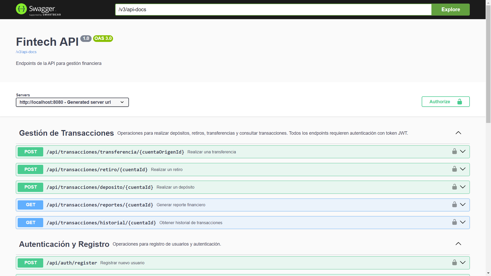
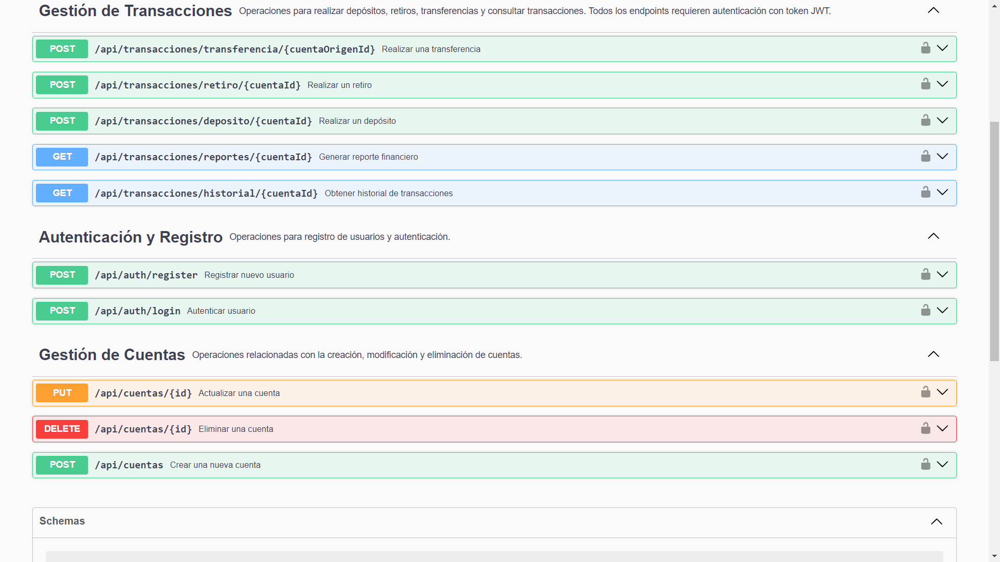
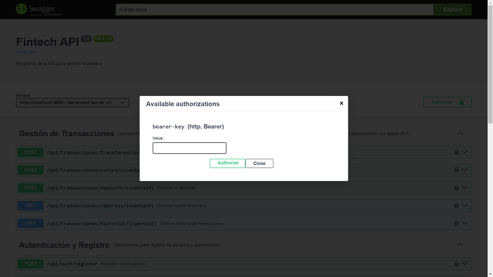

# Prueba Técnica: Desarrollador Backend Senior - FinTech (Java)

[Documentación](#documentación) | [Enunciado](#enunciado)

## Documentación


A continuación se adjunta la documentación de la prueba, sin embargo en este prueba se utilizo 
swagger, ejecutando la prueba y accediendo a:

```bash
http://localhost:8080/swagger-ui/index.html#/
```
Se pueden ver los endpoints junto a una pequeña descripción de los mismos, y configurando la base de datos
se pueden probar estos en forma adecuada.

En la sección de los endpoints se explica esto de una manera más adecuada.

## Menú de Contenidos

- [1. Descripción del Proyecto](#1-descripción-del-proyecto)
- [2. Instalación y Configuración](#2-instalación-y-configuración)
    - [2.1 Clonar el Repositorio](#21-clonar-el-repositorio)
    - [2.2 Configurar la Base de Datos](#22-configurar-la-base-de-datos)
    - [2.3 Ejecutar el Proyecto](#23-ejecutar-el-proyecto)
    - [2.4 Ejecutar las Pruebas](#24-ejecutar-las-pruebas)
- [3. Endpoints de la API](#3-endpoints-de-la-api)
    - [3.1 Endpoint Usuarios](#31-endpoint-usuarios)
        - [3.1.1 Registro de Usuario](#311-registro-de-usuario)
        - [3.1.2 Inicio de Sesión](#312-inicio-de-sesión)
    - [3.2 Endpoints de gestión de cuentas](#32-endpoints-de-gestión-de-cuentas)
        - [3.2.1 Crear cuenta](#321-crear-cuenta)
        - [3.2.2 Actualizar cuenta](#322-actualizar-cuenta)
        - [3.2.3 Eliminar cuenta](#323-eliminar-cuenta)
    - [3.3 Transacciones](#33-transacciones)
        - [3.3.1 Realizar un Depósito](#331-realizar-un-depósito)
        - [3.3.2 Realizar un Retiro](#332-realizar-un-retiro)
        - [3.3.3 Realizar una Transferencia](#333-realizar-una-transferencia)
        - [3.3.4 Obtener Historial de Transacciones](#334-obtener-historial-de-transacciones)
        - [3.3.5 Generar Reporte Financiero](#335-generar-reporte-financiero)
    
- [4. Tolerancia a Fallos](#4-tolerancia-a-fallos)
- [5. Seguridad y Autenticación](#5-seguridad-y-autenticación)
- [6. Auditoría y Logging](#6-auditoría-y-logging)
- [7. Testing](#7-testing)
- [8. Escalabilidad y Rendimiento](#8-escalabilidad-y-rendimiento)
- [9. Rendimiento](#9-rendimiento)


## 1.  Descripción del Proyecto

## Fintech API

La **Fintech API** es una aplicación diseñada para gestionar transacciones financieras, cuentas de usuarios y proporcionar reportes financieros detallados. Este proyecto tiene como objetivo crear una API robusta y segura que permita a los usuarios realizar operaciones como depósitos, retiros y transferencias entre cuentas, así como consultar el historial de transacciones y generar reportes financieros.

### Objetivos

- **Gestión de cuentas**: Permitir a los usuarios crear, actualizar y eliminar cuentas, así como consultar información detallada sobre ellas.
- **Transacciones financieras**: Facilitar depósitos, retiros y transferencias entre cuentas, asegurando la validación de saldos y monedas.
- **Reportes**: Ofrecer funcionalidades para generar reportes financieros personalizados basados en el historial de transacciones.
- **Auditoría y seguridad**: Implementar un sistema de auditoría y registro de logs para garantizar la seguridad y el seguimiento de las operaciones realizadas.

### Estructura del Proyecto

El proyecto está estructurado de la siguiente manera:

- **Controladores**: Manejan las solicitudes HTTP y gestionan la lógica de negocio, interactuando con los servicios.
- **Servicios**: Contienen la lógica de negocio principal y se encargan de la interacción con los repositorios.
- **Repositorios**: Manejan la persistencia de datos utilizando JPA y se comunican con la base de datos.
- **Modelos**: Definen las entidades que representan los datos dentro del sistema.
- **Configuraciones**: Contienen la configuración de seguridad, programación asíncrona y Swagger para la documentación de la API.

Esta estructura modular permite un fácil mantenimiento y escalabilidad, facilitando la adición de nuevas funcionalidades en el futuro.

## 2. Instalación y Configuración

Para clonar el repositorio, configurar la base de datos y ejecutar la API localmente, sigue los siguientes pasos:

## 2.1 Clonar el Repositorio

1. Abre una terminal o consola.
2. Ejecuta el siguiente comando para clonar el repositorio:
   ```bash
   git clone https://github.com/Cbravor1991/Prueba-Tecnica-Backend-Senior-Java.git
3. Accede al directorio del proyecto:
   ```bash
   cd Prueba-Tecnica-Backend-Senior-Java

## 2.2 Configurar la Base de Datos

Asegúrate de tener PostgreSQL instalado y en funcionamiento en tu máquina. Crea una nueva base de datos llamada `fintechdb` utilizando el siguiente comando en la consola de PostgreSQL:
   ```sql
   CREATE DATABASE fintechdb;
   ```

Configura el archivo `application.properties` en el directorio `src/main/resources/` con la dirección necesaria de
la base de datos, y tus credenciales, actualmente el mismo es el siguiente
 ```bash
spring.datasource.url=jdbc:postgresql://localhost:3306/fintechdb
spring.datasource.username=postgres
spring.datasource.password=1234
```

Cambialo según las configuraciones de tu equipo.

## 2.3 Ejecutar el Proyecto

1. Abre una terminal o consola en el directorio del proyecto.
2. Ejecuta el siguiente comando para compilar y ejecutar la aplicación:
   ```bash
   ./mvnw spring-boot:run
   ```
## 2.4 Ejecutar las Pruebas

Para ejecutar las pruebas unitarias y de integración, sigue estos pasos:

1. En la terminal, asegúrate de estar en el directorio del proyecto.
2. Ejecuta el siguiente comando:
   ```bash
   ./mvnw test
    ```


## 3. Endpoints de la API
Como funcionalidad adicional a la prueba técnica se documento el proyecto, utilizando Swagger, una vez que se ejecuta
el proyecto si se accede en el navegador a la siguiente direccion

```bash
http://localhost:8080/swagger-ui/index.html#/
```

y de esta forma se puede acceder a la interfaz que brinda el mismo donde se pueden ver y probar todos los endpoints,
el mismo esta configurado de tal manera que se pueda, realizar la autorización a los endpoints confidenciales 
utilizando el token.



Para probar todos los endpoints primero es necesario tener un usuario, registrado y luego loguearse con el mismo.
Para realiza una prueba manual se pueden ejecutar los endpoints en el siguiente orden.


## 3.1 Endpoint Usuarios

### 3.1.1 Registro de Usuario

- **Endpoint:** `POST /api/auth/register`
- **Descripción:** Permite registrar un nuevo usuario en el sistema.
- **Request Body:**
  ```json
  {
      "username": "christian",
      "password": "1234",
      "nombreCompleto": "Christian Bravo"
  }
  ```


### Respuesta Exitosa:

- **Código de Estado:** 200 OK
- **Cuerpo de Respuesta:**

 ```json
{
  "id": 1,
  "username": "christian",
  "passwordHash": "$2a$10$tGVifeTn.WO........",
  "role": "USER",
  "nombreTitular": "Christian Bravo"
}
  ```

## 3.1.2. Inicio de Sesión

**Endpoint:** `POST /api/auth/login`

**Descripción:** Permite a un usuario autenticarse y obtener un token JWT.

### Request Body:
 ```json

{
"username": "christian",
"password": "1234"
}
```

### Respuesta Exitosa:

- **Código de Estado:** 200 OK
- **Cuerpo de Respuesta:**

```json
{
    "token": "eyJhbGciOiJIUzI1NiIsInR5cCI6IkpXVCJ9..."
}
```


## 3.2. Endpoints de gestión de cuentas
Para acceder a los siguientes endpoints protegidos, es necesario autenticarse utilizando un token Bearer.
Esto se realiza añadiendo el token en el header Authorization en el siguiente seleccionando el candado, se abrira
el siguiente menú donde colocar el token:



### 3.2.1. Crear cuenta

**Endpoint:** `POST /api/cuentas`  
**Descripción:** Permite crear una nueva cuenta asociada al usuario autenticado.

#### Request Body:
```json
{
  "saldo": 15000,
  "moneda": "USD"
}
```

### Response:

- **200 OK**
```json
{
  "id": 1,
  "numeroCuenta": "CUENTA-1729148076251",
  "titular": "Christian Bravo",
  "saldo": 15000,
  "moneda": "USD"
}
```

### 3.2.2. Actualizar cuenta

**Endpoint:** `PUT /api/cuentas/{id}`  
**Descripción:** Permite actualizar los detalles de una cuenta existente.

### Path Variable
- **id** (requerido): El ID de la cuenta que se desea actualizar.

#### Request Body
```json
{
"saldo": 20000,
"moneda": "EUR"
}
```

### Response:

- **200 OK**
```json
{
  "id": 1,
  "numeroCuenta": "CUENTA-1729148076251",
  "titular": "Christian Bravo",
  "saldo": 15250,
  "moneda": "EUR"
}

```

## 3.2.3 Eliminar cuenta

**Endpoint:** `DELETE /api/cuentas/{id}`  
**Descripción:** Permite eliminar una cuenta existente.


### Path Variable
- **id** (requerido): El ID de la cuenta que se desea eliminar.

### Response:
- **204 No Content**
- **403 Forbidden**

## 3.1 Transacciones

Para acceder a los siguientes endpoints protegidos, es necesario autenticarse utilizando un token Bearer.

### 3.1.1 Realizar un Depósito

- **Endpoint:** `POST /api/transacciones/deposito/{cuentaId}`
- **Descripción:** Permite realizar un depósito en la cuenta especificada.
### Path Variable
- **id** (requerido): El ID de la cuenta que se desea depositar dinero.

- 
- **Request Body:**
  ```json
  {
    "monto": 500
  }

### Response:

- **Status 200:** Depósito realizado exitosamente.

  ```json
  {
  "id": 2,
  "cuentaOrigenId": 2,
  "cuentaDestinoId": null,
  "monto": 500,
  "tipo": "DEPOSITO",
  "fecha": [
    2024,
    10,
    17,
    4,
    55,
    1,
    714246500
  ]
  }


### 3.1.2. Realizar un Retiro

**Endpoint:** `POST /api/transacciones/retiro/{cuentaId}`  
**Descripción:** Realiza un retiro de la cuenta especificada.
### Path Variable
- **id** (requerido): El ID de la cuenta que se desea retirar dinero.

### Request Body:
```json
{
  "monto": 200.00
}
```

### Response:

- **Status 200:** Retiro realizado exitosamente.

```json

{
  "id": 3,
  "cuentaOrigenId": 2,
  "cuentaDestinoId": null,
  "monto": 500,
  "tipo": "RETIRO",
  "fecha": [
    2024,
    10,
    17,
    4,
    57,
    11,
    668440500
  ]
}

```

### 3.1.3 Realizar una Transferencia

Para realizar una trasferencia en necesario tener más de una cuenta sino dara error:

**Endpoint:** `POST /api/transacciones/transferencia/{cuentaOrigenId}`  
**Descripción:** Permite realizar una transferencia desde una cuenta de origen a una cuenta destino.
### Path Variable
- **id** (requerido): El ID de la cuenta de origén para transferir dinero.

### Request Body:
```json
{
"monto": 300.00,
"cuentaDestinoId": 5
}
```

### Response:

- **Status 200:** Transferencia realizado exitosamente.
```json
{
  "id": 4,
  "cuentaOrigenId": 2,
  "cuentaDestinoId": 4,
  "monto": 320,
  "tipo": "TRANSFERENCIA",
  "fecha": [
    2024,
    10,
    17,
    5,
    4,
    2,
    431062900
  ]
```


## 3.1.4. Obtener Historial de Transacciones
En caso que no se pasen datos que coincian se devolvera una lista vacia.

**Endpoint:** `GET /api/transacciones/historial/{cuentaId}`  
**Descripción:** Devuelve el historial de transacciones de una cuenta.

### Path Variable
- **id** (requerido): El ID de la cuenta de la cual se quiere tener el historial.


### Query Params:
- **tipo** : Filtrar por tipo de transacción (DEPOSITO, RETIRO, TRANSFERENCIA).
- **fechaDesde** : Filtrar desde una fecha específica.
- **fechaHasta** : Filtrar hasta una fecha específica.
- **page** : Número de página (default: 0).
- **size** : Tamaño de página (default: 10).

### Query Params:
- **tipo** : DEPOSITO.
- **fechaDesde** : 2024-10-17T00:00:00
- **fechaHasta** : 2024-10-19T08:00:00
- **page** : Número de página (default: 0).
- **size** : Tamaño de página (default: 10).

### Response:
- **Status 200:** Historial de transacciones.
```json
[
  {
    "id": 2,
    "cuentaOrigenId": 2,
    "cuentaDestinoId": null,
    "monto": 500,
    "tipo": "DEPOSITO",
    "fecha": [
      2024,
      10,
      17,
      4,
      55,
      1,
      714247000
    ]
  }
]
```


## 3.1.5. Generar Reporte Financiero

**Endpoint:** `GET /api/transacciones/reportes/{cuentaId}`  
**Descripción:** Genera un reporte financiero para una cuenta en un rango de fechas.


### Path Variable
- **id** (requerido): El ID de la cuenta que se desea generar el reporte.


### Query Params:
- **fechaDesde:** Fecha inicial del reporte.
- **fechaHasta:** Fecha final del reporte.

### Query Params:
- **fechaDesde** : 2024-10-17T00:00:00
- **fechaHasta** : 2024-10-19T08:00:00

### Response:
- **Status 200:** Reporte financiero generado.

```json
{
  "saldoInicial": 14680,
  "totalDepositos": 0,
  "totalRetiros": 0,
  "saldoFinal": 14680,
  "fechaDesde": [
    2024,
    10,
    1,
    0,
    0
  ],
  "fechaHasta": [
    2024,
    10,
    16,
    23,
    59,
    59
  ]
}

```
## 4. Tolerancia a Fallos

Implementa un manejo de excepciones robusto para garantizar que las transacciones financieras no se pierdan o generen inconsistencias en caso de errores. 
En lugar de usar bloques try-catch, se han creado excepciones personalizadas para cada servicio, lo que permite un manejo más limpio y centralizado de los errores,
aunque esto en el enunciado de la prueba solo se solicitaba para el servicio de transacciones, se implemento en cada servicio con el fin de unificar criterios.

### Códigos de Error y Mensajes

| Código de Estado | Error                          | Mensaje de Error                                    |
|------------------|--------------------------------|-----------------------------------------------------|
| 400              | IllegalArgumentException       | Parámetros inválidos en la solicitud.               |
| 400              | TransaccionException           | Error en la transacción, verifique los detalles.   |
| 400              | CuentaException                | Error relacionado con la cuenta, revise la cuenta. |
| 400              | UsuarioException               | Credenciales inválidas o el usuario ya existe.     |
| 404              | RuntimeException               | No encontrado.                                      |
| 500              | Exception                      | Ocurrió un error inesperado: {mensaje}.             |

### Posibles Fallos en el Servicio de Transacciones, Cuentas y Usuarios

1. **Depósito**:
  - **Excepción**: `TransaccionException`
    - Mensaje: "El monto debe ser positivo"
  - **Excepción**: `CuentaException`
    - Mensaje: "Cuenta no encontrada"

2. **Retiro**:
  - **Excepción**: `TransaccionException`
    - Mensaje: "El monto debe ser positivo"
  - **Excepción**: `TransaccionException`
    - Mensaje: "Saldo insuficiente"
  - **Excepción**: `CuentaException`
    - Mensaje: "Cuenta no encontrada"

3. **Transferencia**:
  - **Excepción**: `TransaccionException`
    - Mensaje: "El monto debe ser positivo"
  - **Excepción**: `TransaccionException`
    - Mensaje: "Saldo insuficiente en la cuenta origen"
  - **Excepción**: `TransaccionException`
    - Mensaje: "Las cuentas deben tener el mismo tipo de moneda para realizar la transferencia"
  - **Excepción**: `CuentaException`
    - Mensaje: "Cuenta no encontrada"

4. **Historial de Transacciones**:
  - **Excepción**: `CuentaException`
    - Mensaje: "Cuenta no encontrada"

5. **Reporte Financiero**:
  - **Excepción**: `CuentaException`
    - Mensaje: "Cuenta no encontrada"

6. **Crear Cuenta**:
  - **Excepción**: `CuentaException`
    - Mensaje: "Usuario no encontrado"

7. **Actualizar Cuenta**:
  - **Excepción**: `CuentaException`
    - Mensaje: "No tiene permiso para actualizar esta cuenta"

8. **Eliminar Cuenta**:
  - **Excepción**: `CuentaException`
    - Mensaje: "No tiene permiso para eliminar esta cuenta"

9. **Registrar Usuario**:
  - **Excepción**: `UsuarioException`
    - Mensaje: "El usuario ya existe."

10. **Autenticar Usuario**:
  - **Excepción**: `UsuarioException`
    - Mensaje: "Credenciales inválidas"

11. **Cargar Detalles de Usuario**:
  - **Excepción**: `UsuarioException`
    - Mensaje: "Usuario no encontrado: {username}"


## 5. Seguridad y Autenticación

La API está protegida mediante un sistema de autenticación y autorización basado en JSON Web Tokens (JWT). Este enfoque asegura que solo los usuarios autenticados y autorizados puedan acceder a los recursos de la API, como la creación, actualización y eliminación de cuentas.

### Implementación de JWT

- **Generación del Token:** Al iniciar sesión, el usuario proporciona sus credenciales (nombre de usuario y contraseña). Si las credenciales son válidas, se genera un JWT que incluye información relevante sobre el usuario (por ejemplo, el nombre de usuario). Este token se firma utilizando una clave secreta para garantizar su integridad.

- **Almacenamiento del Token:** El token generado se envía al cliente, que debe almacenarlo localmente (por ejemplo, en localStorage o en cookies) para utilizarlo en futuras solicitudes a la API.

- **Autenticación en las Solicitudes:** Para acceder a los endpoints protegidos, como la creación, actualización y eliminación de cuentas, el cliente debe incluir el JWT en el encabezado `Authorization` de la solicitud HTTP. El formato del encabezado es:

```bash
Authorization: Bearer <token>
```


- **Validación del Token:** En el lado del servidor, se interceptan las solicitudes entrantes mediante un filtro de seguridad que valida el JWT. Si el token es válido y no ha expirado, se permite el acceso al recurso solicitado. Si el token es inválido o ha expirado, se devuelve un `401 Unauthorized`.

- **Control de Acceso:** Adicionalmente, se implementan controles de acceso basados en el rol del usuario. Por ejemplo, en el endpoint de eliminación de cuentas, se verifica que el usuario que intenta eliminar una cuenta sea el titular de la misma. Si el usuario no es el titular, se devuelve un `403 Forbidden`.

### Manejo de Errores

En caso de errores durante el proceso de autenticación o autorización (por ejemplo, token inválido o cuenta no encontrada), se utilizan excepciones personalizadas y un controlador global de excepciones (`GlobalExceptionHandler`) para devolver respuestas apropiadas con mensajes claros para el cliente. Esto mejora la experiencia del usuario y facilita la depuración.


## 6. Auditoría y Logging

La aplicación implementa un sistema de auditoría y logging para rastrear las acciones realizadas en la API y proporcionar un registro detallado 
de las operaciones que afectan a las cuentas de usuario (transaccione, altas bajas, etc). 
Este enfoque ayuda en el diagnóstico de problemas, mejora la seguridad y puede ser utilizado en futuras auditorias.

### 6.1 Sistema de Logging

#### 6.1.1 Uso de SLF4J
La aplicación utiliza **SLF4J (Simple Logging Facade for Java)** junto con una implementación de logging, como **Logback**, para manejar los logs. Esta elección permite una gestión flexible y eficiente de los mensajes de log, ajustando el nivel de detalle según las necesidades del entorno.

#### 6.1.2 Niveles de Log
Se registran mensajes en diferentes niveles (info, error, warn) dependiendo de la gravedad del evento. 
En nuestra prueba solo usamos info, ya que se nos solicita generar los log para posibles auditorias no para encontrar problemas de ejecución.

- **Info**: Se registran eventos importantes, como la creación, actualización de cuentas, así como las diversas transacciones. 
- Esto permite auditar las operaciones realizadas por los usuarios y tener un seguimiento de las acciones significativas.


Cada acción relacionada con la gestión de cuentas se registra. Por ejemplo, en la clase **CuentaService**, se registra cuando se crea, actualiza o elimina una cuenta:

- **Creación de cuenta**: Se registra un mensaje indicando que se ha creado una nueva cuenta, incluyendo detalles relevantes como el ID de la cuenta y el saldo inicial.

- **Actualización de cuenta**: Se registra un mensaje cuando se actualizan los detalles de una cuenta, especificando qué campos han cambiado y sus nuevos valores.

- **Eliminación de cuenta**: Se registra un mensaje al eliminar una cuenta, incluyendo el ID de la cuenta que ha sido eliminada.

Este registro de eventos
```bash
logger.info("Creando nueva cuenta para el titular: {}", cuenta.getTitular());
logger.info("Cuenta creada exitosamente con ID: {}", cuentaGuardada.getId());
```

### 6.2 Configuración de Logging

La configuración de logging está definida en el archivo **logback.xml**, donde se han establecido dos appenders:

- **CONSOLE**: Este appender permite la visualización de logs en la consola con un patrón de salida bien estructurado, facilitando el monitoreo en tiempo real de las operaciones.

- **FILE**: Este appender registra los logs en archivos, utilizando un **RollingFileAppender** para archivar automáticamente los logs diarios y mantener un historial de hasta 30 días. 
Esto asegura que se conserve un registro histórico de las actividades de la API sin sobrecargar el sistema con archivos de log antiguos.


### 7. Testing

Aunque la prueba no requería la implementación de pruebas unitarias, considero fundamental garantizar 
la calidad y el correcto funcionamiento de nuestros servicios mediante la creación de pruebas automatizadas. 
Estas pruebas están diseñadas para verificar el comportamiento esperado de los servicios **CuentaService**, **TransaccionService** y **UsuarioService**.
A continuación, se describen brevemente las pruebas realizadas:

### Ubicación de las Pruebas
`src/test/java/com/gestion/fintech/services`

### CuentaServiceTest
- **crearCuenta_shouldReturnCuenta**:
  - Verifica que al crear una cuenta, se retorne un objeto **Cuenta** no nulo y que contenga el titular correcto. También se asegura de que el método **save** del repositorio sea invocado una vez.

- **actualizarCuenta_shouldReturnUpdatedCuenta**:
  - Asegura que la cuenta se actualice correctamente y se devuelva el objeto actualizado, verificando que se haya llamado a **findById** y **save** en el repositorio.

- **eliminarCuenta_shouldNotThrowException**:
  - Comprueba que al eliminar una cuenta, no se lance ninguna excepción y que se invoque **deleteById** en el repositorio.

- **obtenerCuentaPorId_shouldReturnCuenta**:
  - Verifica que al obtener una cuenta por su ID, se retorne un objeto **Cuenta** no nulo y se llame al método **findById** del repositorio.

- **obtenerCuentaPorId_shouldThrowException_whenCuentaNotFound**:
  - Asegura que se lance una excepción cuando se intenta obtener una cuenta que no existe.

### TransaccionServiceTest
- **obtenerCuentaPorId_CuentaExistente_RetornaCuenta**:
  - Verifica que al obtener una cuenta existente, se retorne el objeto correcto y se invoque **findById**.

- **obtenerCuentaPorId_CuentaNoExistente_LanzaException**:
  - Comprueba que se lance una excepción si se intenta obtener una cuenta que no existe.

- **realizarDeposito_MontoValido_RetornaTransaccion**:
  - Asegura que al realizar un depósito con un monto válido, se retorne un objeto **Transaccion** y se actualice el saldo de la cuenta.

- **realizarDeposito_MontoInvalido_LanzaTransaccionException**:
  - Verifica que se lance una excepción si se intenta realizar un depósito con un monto negativo.

- **realizarRetiro_MontoValido_RetornaTransaccion**:
  - Comprueba que al realizar un retiro con un monto válido, se retorne un objeto **Transaccion** y se actualice el saldo de la cuenta.

- **realizarRetiro_SaldoInsuficiente_LanzaTransaccionException**:
  - Verifica que se lance una excepción si se intenta retirar un monto mayor al saldo disponible.

- **realizarTransferencia_MontoValido_RetornaTransaccion**:
  - Asegura que al realizar una transferencia con un monto válido, se retorne un objeto **Transaccion** y se actualicen los saldos de ambas cuentas.

- **realizarTransferencia_MonedasDistintas_LanzaTransaccionException**:
  - Comprueba que se lance una excepción si se intenta realizar una transferencia entre cuentas de diferentes monedas.

- **obtenerHistorial_RetornaTransacciones**:
  - Verifica que se retornen las transacciones correctas al solicitar el historial.

### UsuarioServiceTest
- **testRegistrarUsuario_Success**:
  - Verifica que al registrar un usuario nuevo, se retorne un objeto **Usuario** no nulo con el nombre de usuario correcto y la contraseña encriptada.

- **testRegistrarUsuario_UsuarioYaExiste**:
  - Asegura que se lance una excepción si se intenta registrar un usuario que ya existe.

- **testAutenticarUsuario_Success**:
  - Verifica que al autenticar un usuario con credenciales correctas, se retorne un objeto **Usuario** que coincida con el nombre de usuario.

- **testAutenticarUsuario_Fail**:
  - Asegura que no se retorne ningún usuario si las credenciales son incorrectas.


## 8. Escalabilidad

La API está preparada para manejar un alto volumen de solicitudes concurrentes gracias al uso de la anotación `@Async` y `CompletableFuture`. 
Esto permite que las operaciones críticas, como depósitos, retiros, transferencias, y la generación de reportes o historial de transacciones, se ejecuten de manera asíncrona, liberando el hilo principal y permitiendo que el sistema gestione múltiples solicitudes simultáneamente sin bloqueo.

La decisión de utilizar `@Async` junto con `CompletableFuture` garantiza que las tareas de larga duración no afecten el rendimiento general de la API, permitiendo la concurrencia controlada sin necesidad de complejos manejos de hilos manuales. Además, cada operación está diseñada para ser transaccional, lo que asegura la consistencia de los datos en escenarios concurrentes.

## 9. Rendimiento

Para optimizar el rendimiento en las consultas a la base de datos, se han implementado varias técnicas. Se utilizan índices en las columnas más consultadas de la tabla `Transaccion`, como `cuenta_origen_id`, `cuenta_destino_id`, `tipo` y `fecha`, lo cual mejora significativamente los tiempos de búsqueda y filtrado de datos. Estas son las definiciones de índices utilizadas:

```java
indexes = {
    @Index(name = "idx_cuenta_origen_id", columnList = "cuenta_origen_id"),
    @Index(name = "idx_cuenta_destino_id", columnList = "cuenta_destino_id"),
    @Index(name = "idx_tipo", columnList = "tipo"),
    @Index(name = "idx_fecha", columnList = "fecha")
}
```
Además, se utilizan consultas optimizadas, como la siguiente consulta personalizada para sumar los montos de transacciones según su tipo dentro de un rango de fechas:

```java
@Query("SELECT SUM(t.monto) FROM Transaccion t WHERE t.cuentaOrigenId = :cuentaId AND t.tipo = :tipo AND t.fecha BETWEEN :fechaDesde AND :fechaHasta")
BigDecimal sumarMontosPorTipo(@Param("cuentaId") Long cuentaId, @Param("tipo") String tipo, @Param("fechaDesde") LocalDateTime fechaDesde, @Param("fechaHasta") LocalDateTime fechaHasta);
```

Estas optimizaciones permiten que las operaciones como la generación de reportes financieros y el historial de transacciones se ejecuten de manera eficiente, incluso con grandes volúmenes de datos, reduciendo considerablemente la carga en el sistema y mejorando el tiempo de respuesta en consultas complejas.


---

## Enunciado
Estás postulando para una posición como desarrollador backend senior en una empresa FinTech que ofrece una plataforma para la gestión de cuentas financieras, transferencias y análisis en tiempo real. Tu tarea es desarrollar una API robusta y escalable que permita realizar operaciones financieras clave mientras aseguras la seguridad y el rendimiento de la aplicación.

### Requisitos Funcionales

#### Gestión de cuentas de usuario:
- Desarrolla endpoints REST para crear, actualizar y eliminar cuentas de usuario.
- Cada cuenta debe tener los siguientes atributos:
  - Nombre del titular
  - Número de cuenta (único, generado automáticamente)
  - Saldo actual
  - Moneda (USD, EUR, etc.)
- Valida que los saldos no puedan ser negativos.

#### Transacciones:
- Implementa endpoints para realizar:
  - Depósitos
  - Retiros
  - Transferencias entre cuentas
- Asegúrate de que las transacciones sean atómicas utilizando técnicas como control de transacciones en la base de datos para evitar inconsistencias.
- Registra cada transacción con detalles como el tipo, monto, fecha y cuentas involucradas.

#### Historial de transacciones:
- Crea un endpoint que permita obtener el historial de transacciones de una cuenta.
- Incluye filtros por fecha y tipo de transacción.

#### Reportes financieros:
- Implementa un endpoint para generar reportes financieros, mostrando el saldo inicial, movimientos (depósitos/retiros) y saldo final para un rango de fechas específico.

#### Seguridad:
- Utiliza JWT (JSON Web Tokens) para autenticación y autorización.
- Solo los usuarios autenticados deben poder acceder a sus cuentas y realizar operaciones financieras.
- Asegura que cada cuenta solo sea accesible por su titular.

### Requisitos No Funcionales

#### Escalabilidad:
- La API debe estar preparada para manejar un gran volumen de solicitudes concurrentes. Utiliza prácticas de programación concurrente en Java (ej., ExecutorService o CompletableFuture).

#### Rendimiento:
- Optimiza las consultas de base de datos para que los reportes y el historial de transacciones respondan de manera eficiente, incluso con grandes volúmenes de datos.

#### Persistencia:
- Utiliza Spring Data JPA o Hibernate para gestionar la persistencia de datos con una base de datos relacional como PostgreSQL.
- Las transacciones deben ser consistentes y utilizar manejo adecuado de commit y rollback.

#### Tolerancia a fallos:
- Implementa manejo de excepciones robusto para garantizar que las transacciones financieras no se pierdan o generen inconsistencias en caso de errores.

#### Auditoría y Logging:
- Implementa logs detallados para registrar todas las transacciones, accesos y cambios en las cuentas, que puedan ser usados para auditorías futuras.
- Usa una librería como SLF4J con Logback para gestionar los logs.

### Stack Tecnológico Obligatorio:
- Lenguaje: Java 11 o superior
- Framework: Spring Boot
- Persistencia: Spring Data JPA o Hibernate con PostgreSQL
- Seguridad: Spring Security con JWT para autenticación
- Testing: JUnit, Mockito para pruebas unitarias y de integración


---

